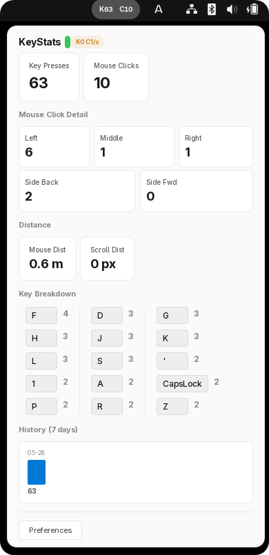

# KeyStats.Linux

English | [简体中文](README.zh-CN.md)

Privacy-first keyboard and mouse statistics for Linux — a GNOME Shell integration with a Rust-backed daemon.

Inspired by [KeyStats](https://github.com/debugtheworldbot/KeyStats) (macOS &amp; Windows), this is an independent Linux implementation that tracks keyboard and mouse input statistics.

<p align="center">
  
</p>

## Architecture

```
┌──────────────────────┐     D-Bus (session bus)     ┌─────────────────────┐
│  GNOME Shell Extension│◄──────────────────────────►│   keystats-daemon   │
│  (GJS / St / GTK)    │                             │   (Rust / evdev)    │
│                       │                             │                     │
│  • Panel indicator    │                             │  • evdev event loop │
│  • Popup dashboard    │                             │  • SQLite storage   │
│  • Preferences window │                             │  • Stats manager    │
└──────────────────────┘                             └─────────┬───────────┘
                                                               │
                                                     D-Bus signals
                                                               │
                                                     ┌─────────▼───────────┐
                                                     │  keystats-overlay    │
                                                     │  (GTK4 overlay)     │
                                                     │                      │
                                                     │  • Real-time keys    │
                                                     │  • Fade animation    │
                                                     │  • X11/Wayland       │
                                                     └──────────────────────┘

                                                     ┌──────────────────────┐
                                                     │    keystatsctl       │
                                                     │    (CLI tool)        │
                                                     │                      │
                                                     │  • status / doctor   │
                                                     │  • history (charts)  │
                                                     └──────────────────────┘
```

- **keystats-daemon** — Reads `/dev/input/event*` via evdev, aggregates privacy-preserving stats, persists to SQLite, exposes D-Bus API
- **GNOME Shell extension** — Panel indicator + popup dashboard + preferences, consumes daemon data over D-Bus
- **keystats-overlay** — Standalone keystroke visualization overlay for screencasting, subscribes to daemon's D-Bus signals
- **keystatsctl** — CLI for diagnostics and status checks

## Features

- Key press count and key breakdown (top 15 keys)
- Mouse clicks (left, middle, right, side buttons)
- Mouse distance (px → m → km) and scroll distance
- KPS/CPS rate display with peak tracking
- 7-day history with daily bar charts (GNOME Shell popup)
- `keystatsctl history` — terminal bar charts with configurable day range
- **Keystroke overlay** — real-time key visualization with fade-out animation (for screencasting/streaming)
- System theme-aware (dark/light)
- Internationalization (English + Simplified Chinese)
- Periodic device re-scan for USB/Bluetooth hotplug

## Quick Start

### Prerequisites

- **Rust** 1.70+
- **GNOME Shell** 45+
- **input** group membership: `sudo usermod -aG input $USER` (log out/in after)
- **gettext** (for locale compilation)
- **glib2** (for `glib-compile-schemas`)
- **libgtk-4-dev** (overlay only, for building keystroke overlay)

### Build & Install

```bash
git clone https://github.com/0x5c0f/KeyStats.Linux.git
cd KeyStats.Linux

# Build all (daemon + CLI + locale)
make build

# Install everything (daemon + systemd + extension)
make install

# Start the daemon
systemctl --user enable --now keystats

# Restart GNOME Shell (Alt+F2 → r on X11, or log out/in on Wayland)
# Enable the extension
gnome-extensions enable keystats@0x5c0f.github.io
```

For safe upgrades while the extension is active (prevents GNOME Shell crash from file replacement):

```bash
make upgrade  # stops service → disables extension → installs → restarts
```

Or package the extension as zip for distribution:

```bash
make zip
gnome-extensions install gnome-extension/keystats@0x5c0f.github.io.zip
```

### Verify

```bash
keystatsctl status
keystatsctl doctor
keystatsctl history              # 7-day terminal chart (keys + clicks)
keystatsctl history --days 30    # last 30 days
keystatsctl history --keys       # key presses only
keystatsctl keys                 # today's key breakdown
keystatsctl keys --date 2026-06-01 --limit 10
```

### Keystroke Overlay (optional)

The overlay displays real-time key presses for screencasting or streaming:

<p align="center">
  
</p>

```bash
# Install overlay
make install-overlay

# Run overlay (default: top-left, 800ms fade)
keystats-overlay

# Customize position and appearance
keystats-overlay --position bottom-right --opacity 30 --fade-duration 1000
```

Runtime dependency: `libgtk-4` (pre-installed on most GNOME desktops).

For detailed installation options, permissions troubleshooting, and packaging instructions, see [packaging/README.md](packaging/README.md).

## Known Issues

- **Overlay blocks mouse input**: The keystroke overlay window (`keystats-overlay`) captures mouse events in the area it covers. Clicks on windows behind the overlay will not pass through. Workaround: position the overlay in a non-critical screen area using `--position`.

## Project Structure

```
KeyStats.Linux/
├── Cargo.toml                    ← Rust workspace root
├── Cargo.lock
├── crates/
│   ├── keystats-core/            ← Shared data model, formatting, import/export
│   ├── keystats-daemon/          ← evdev input pipeline, SQLite, D-Bus service
│   ├── keystatsctl/              ← CLI diagnostics tool
│   └── keystats-overlay/         ← GTK4 keystroke visualization overlay
├── gnome-extension/              ← GNOME Shell extension (GJS)
│   ├── extension.js              ← Panel indicator + popup UI
│   ├── prefs.js                  ← Preferences window (Adw/GTK4)
│   ├── stylesheet.css            ← Dark/light theme
│   ├── schemas/                  ← GSettings schema
│   ├── po/                       ← Translation sources
│   ├── locale/                   ← Compiled .mo files
│   └── Makefile                  ← Build/install targets
├── packaging/
│   ├── README.md / README.zh-CN.md  ← Detailed packaging docs
│   ├── systemd/keystats.service   ← User systemd unit
│   └── udev/60-keystats-input.rules ← Input device permissions
└── docs/
    ├── superpowers/specs/        ← Design specifications
    ├── superpowers/plans/        ← Implementation plans
    └── handoff/                  ← Project context documents
```

## Privacy

KeyStats.Linux records key press frequency, mouse movement distance aggregated from raw input events. The daemon processes evdev events in-memory, extracts only aggregate counts and distances, then discards the original event data. Only aggregated statistics are persisted to SQLite.

## License

MIT — see [LICENSE](LICENSE).

## Acknowledgments

Inspired by [KeyStats](https://github.com/debugtheworldbot/KeyStats) (macOS &amp; Windows) by [@debugtheworldbot](https://github.com/debugtheworldbot).
