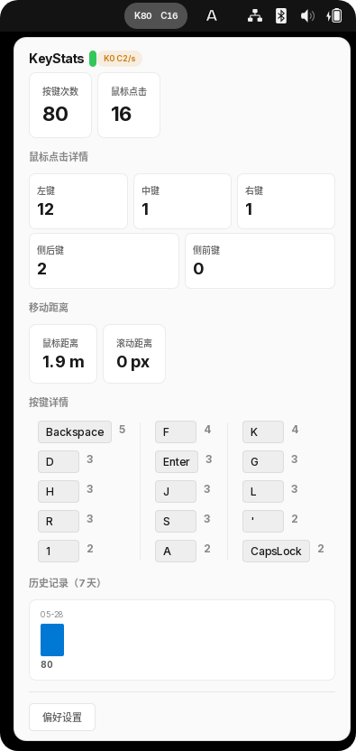
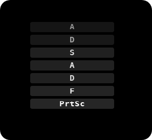

# KeyStats.Linux

[English](README.md) | 简体中文

隐私优先的 Linux 键盘鼠标统计工具 — 基于 GNOME Shell 集成，Rust 守护进程后端。

受 [KeyStats](https://github.com/debugtheworldbot/KeyStats)（macOS &amp; Windows）启发，这是一个独立的 Linux 实现的键盘和鼠标输入统计工具。

<p align="center">
  
</p>

## 架构

```
┌──────────────────────┐     D-Bus (会话总线)     ┌─────────────────────┐
│  GNOME Shell 扩展     │◄──────────────────────►│   keystats-daemon   │
│  (GJS / St / GTK)    │                         │   (Rust / evdev)    │
│                       │                         │                     │
│  • 面板指示器          │                         │  • evdev 事件循环    │
│  • 弹出面板            │                         │  • SQLite 存储      │
│  • 偏好设置窗口        │                         │  • 统计管理器       │
└──────────────────────┘                         └─────────┬───────────┘
                                                           │
                                                 D-Bus 信号
                                                           │
                                                 ┌─────────▼───────────┐
                                                 │  keystats-overlay    │
                                                 │  (GTK4 按键悬浮层)   │
                                                 │                      │
                                                 │  • 实时按键显示       │
                                                 │  • 淡出动画          │
                                                 │  • X11/Wayland       │
                                                 └──────────────────────┘

                                                 ┌──────────────────────┐
                                                 │    keystatsctl       │
                                                 │    (命令行工具)       │
                                                 │                      │
                                                 │  • status / doctor   │
                                                 │  • history (图表)    │
                                                 └──────────────────────┘
```

- **keystats-daemon** — 通过 evdev 读取 `/dev/input/event*`，聚合隐私安全的统计数据，持久化到 SQLite，暴露 D-Bus API
- **GNOME Shell 扩展** — 面板指示器 + 弹出面板 + 偏好设置，通过 D-Bus 消费 daemon 数据
- **keystats-overlay** — 独立按键可视化悬浮层，适用于屏幕录制/直播，订阅 daemon 的 D-Bus 信号
- **keystatsctl** — 诊断和状态查询的命令行工具

## 功能

- 按键次数统计和按键详情（前 15 个按键）
- 鼠标点击统计（左键、中键、右键、侧键）
- 鼠标移动距离（px → 米 → 公里）和滚动距离
- KPS/CPS 实时速率显示，含峰值追踪
- 7 天历史记录，含每日柱状图（GNOME Shell 弹出面板）
- `keystatsctl history` — 终端柱状图，支持自定义天数范围
- **按键悬浮层** — 实时按键可视化，带淡出动画（适用于屏幕录制/直播）
- 系统主题自适应（深色/浅色）
- 国际化支持（英文 + 简体中文）
- 定时设备重扫描，处理 USB/蓝牙热插拔

## 快速开始

### 前提条件

- **Rust** 1.70+
- **GNOME Shell** 45+
- **input** 用户组权限：`sudo usermod -aG input $USER`（执行后重新登录）
- **gettext**（用于语言包编译）
- **glib2**（用于 `glib-compile-schemas`）
- **libgtk-4-dev**（仅 overlay 需要，用于构建按键悬浮层）

### 构建和安装

```bash
git clone https://github.com/0x5c0f/KeyStats.Linux.git
cd KeyStats.Linux

# 构建全部（daemon + CLI + 语言包）
make build

# 安装全部（daemon + systemd + 扩展）
make install

# 启动守护进程
systemctl --user enable --now keystats

# 重启 GNOME Shell（X11：Alt+F2 → r；Wayland：注销重登）
# 启用扩展
gnome-extensions enable keystats@0x5c0f.github.io
```

安全升级（扩展运行时使用，防止 GNOME Shell 崩溃）：

```bash
make upgrade  # 停止服务 → 禁用扩展 → 安装 → 重启
```

或打包为 zip 分发：

```bash
make zip
gnome-extensions install gnome-extension/keystats@0x5c0f.github.io.zip
```

### 验证

```bash
keystatsctl status
keystatsctl doctor
keystatsctl history              # 7 天终端柱状图（按键 + 鼠标）
keystatsctl history --days 30    # 最近 30 天
keystatsctl history --keys       # 仅按键统计
keystatsctl keys                 # 今日按键统计
keystatsctl keys --date 2026-06-01 --limit 10
```

### 按键悬浮层（可选）

悬浮层用于屏幕录制或直播时显示实时按键：

<p align="center">
  
</p>

```bash
# 安装悬浮层
make install-overlay

# 运行（默认：左上角，800ms 淡出）
keystats-overlay

# 自定义位置和外观
keystats-overlay --position bottom-right --opacity 30 --fade-duration 1000
```

运行时依赖：`libgtk-4`（大多数 GNOME 桌面已预装）。

更多安装选项、权限排查和打包说明详见 [packaging/README.zh-CN.md](packaging/README.zh-CN.md)。

## 项目结构

```
KeyStats.Linux/
├── Cargo.toml                    ← Rust workspace 根配置
├── Cargo.lock
├── crates/
│   ├── keystats-core/            ← 共享数据模型、格式化、导入导出
│   ├── keystats-daemon/          ← evdev 输入管线、SQLite、D-Bus 服务
│   ├── keystatsctl/              ← CLI 诊断工具
│   └── keystats-overlay/         ← GTK4 按键可视化悬浮层
├── gnome-extension/              ← GNOME Shell 扩展（GJS）
│   ├── extension.js              ← 面板指示器 + 弹出面板 UI
│   ├── prefs.js                  ← 偏好设置窗口（Adw/GTK4）
│   ├── stylesheet.css            ← 深色/浅色主题
│   ├── schemas/                  ← GSettings schema
│   ├── po/                       ← 翻译源文件
│   ├── locale/                   ← 编译后的 .mo 文件
│   └── Makefile                  ← 构建/安装目标
├── packaging/
│   ├── README.md / README.zh-CN.md  ← 详细打包文档
│   ├── systemd/keystats.service   ← 用户 systemd 单元
│   └── udev/60-keystats-input.rules ← 输入设备权限规则
└── docs/
    ├── superpowers/specs/        ← 设计规格文档
    ├── superpowers/plans/        ← 实现计划文档
    └── handoff/                  ← 项目交接文档
```

## 隐私说明

KeyStats.Linux 从原始输入事件中聚合记录按键频次和鼠标移动距离。守护进程在内存中处理 evdev 事件，仅提取聚合计数和距离数据，随后丢弃原始事件数据。仅汇总统计数据会被持久化到 SQLite。

## 开源许可

MIT — 详见 [LICENSE](LICENSE)。

## 致谢

受 [KeyStats](https://github.com/debugtheworldbot/KeyStats)（macOS &amp; Windows）启发，感谢原作者 [@debugtheworldbot](https://github.com/debugtheworldbot)。
